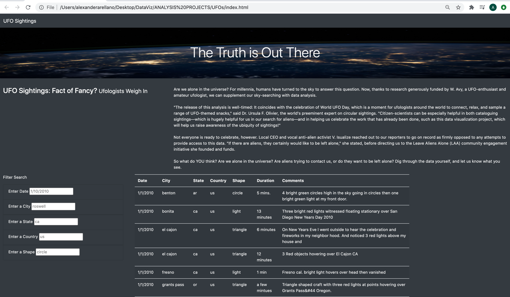
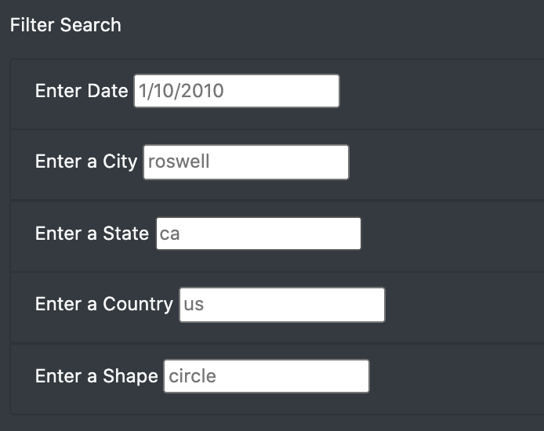
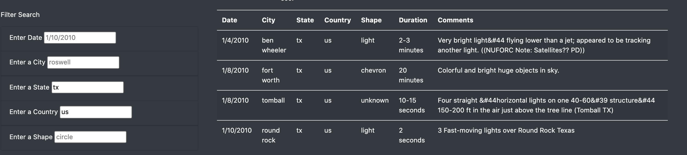

# UFOs

## Overview
This project was undertaken to build a dynamic webpage that allows users to find information on UFO sightings and allow users to filter data about the UFO sightings based on their input to the site. The first iteration of the UFO sighting site allowed users to filter their search results only by the date of the sighting.  As an extension to the original website built, we built additional functionality into the website which allows users to filter by the city, state, and country where the sightings took place, as well as by the shape of the reported sighting. We used JavaScript as well as HTML and CSS to code the original website and build the functionality for rendering the information about the website and the the dataset of UFO sightings on the site in table format. 

### Resources

Data source:
* UFO sighting dataset: data.js

Languages:
* JavaScript
* HTML
* CSS

Software utilized:
* Visual Studio Code Version: 1.47.3

## Results

### How to perform a search:
When the user loads the UFO Sightings website (currently hosted locally), the website will render the static site information like the title, headers, background image and data table pulled from our data source of sightings:

The user can filter the search results by entering search parameters like date, city, state, country and shape. (each input tab under "Filter Search" contains placeholder or sample text in a semi-translucent grey font to indicate to the user how they should enter their search criteria). The user can mouse into any search input area, as well as use the 'tab' or 'return' keys to move through the input boxes:

### Example Search:
Users can search by one or multiple criteria. For example, entering "tx" into the "Enter a State" field and entering "us" into the "Enter a Country" field will have the site filter the UFO sightings for those 2 parameters and render the filtered results in the table:

## Summary:
* The UFO Sightings site is dynamic and interactive, allowing UFO enthusiasts to find information on sightings and filter their searches. A possible drawback the site has is the limited dataset it pulls sighting information from. The dataset used to build and filter the site only has data for sightings that occurred in 2010 in the US. 

* This site could be further developed to include additional functionality and a broader dataset to pull sighting information from.
    * Webscraping could be built into this site, to scrape more recent news about UFO sightings. Additional JavaScript code could be written to scrape search sites like google.com or bing.com for the latest news articles about UFO sightings. The webscrape results could be rendered on the UFO sightings
    * Results from webscraping news sites for new UFO sightings could be appended to our data set, extracting the date, city, state, country and shape (if possible) of the new sightings and adding them to our existing dataset.  This functionality could continually expand the dataset and provide more data for UFO enthusiasts to have available on the site.
